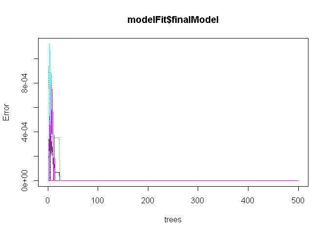

# Practical Machine Learning Project
Medhat S.  
October 11, 2016  

#### Background

Using devices such as Jawbone Up, Nike FuelBand, and Fitbit it is now possible to collect a large amount of data about personal activity relatively inexpensively. These type of devices are part of the quantified self movement - a group of enthusiasts who take measurements about themselves regularly to improve their health, to find patterns in their behavior, or because they are tech geeks. One thing that people regularly do is quantify how much of a particular activity they do, but they rarely quantify how well they do it. In this project, your goal will be to use data from accelerometers on the belt, forearm, arm, and dumbell of 6 participants. They were asked to perform barbell lifts correctly and incorrectly in 5 different ways. More information is available from the website here: http://groupware.les.inf.puc-rio.br/har (see the section on the Weight Lifting Exercise Dataset).

The training data for this project are available here:
https://d396qusza40orc.cloudfront.net/predmachlearn/pml-training.csv

The test data are available here:
https://d396qusza40orc.cloudfront.net/predmachlearn/pml-testing.csv

The goal of this project is to predict the manner in which they did the exercise. This is the "classe" variable in the training set.  
This report describes:  
+ How the model is built,  
+ How the cross validation is used,  
+ The expection of out of sample error  
  
  
#### Load Data
  

```r
## load training data set
pml.training <- read.csv("https://d396qusza40orc.cloudfront.net/predmachlearn/pml-training.csv")
```

#### Explore Data


```r
summary(pml.training)
```
 >     ::: 
 >     pitch_belt          yaw_belt       total_accel_belt kurtosis_roll_belt
 >     Min.   :-55.8000   Min.   :-180.00   Min.   : 0.00             :19216   
 >     1st Qu.:  1.7600   1st Qu.: -88.30   1st Qu.: 3.00    #DIV/0!  :   10   
 >     Median :  5.2800   Median : -13.00   Median :17.00    -1.908453:    2   
 >     Mean   :  0.3053   Mean   : -11.21   Mean   :11.31    -0.016850:    1   
 >     3rd Qu.: 14.9000   3rd Qu.:  12.90   3rd Qu.:18.00    -0.021024:    1   
 >     Max.   : 60.3000   Max.   : 179.00   Max.   :29.00    -0.025513:    1   
 >                                                           (Other)  :  391   
 >     kurtosis_picth_belt kurtosis_yaw_belt skewness_roll_belt skewness_roll_belt.1
 >              :19216            :19216              :19216             :19216     
 >     #DIV/0!  :   32     #DIV/0!:  406     #DIV/0!  :    9    #DIV/0!  :   32     
 >     47.000000:    4                       0.000000 :    4    0.000000 :    4     
 >     -0.150950:    3                       0.422463 :    2    -2.156553:    3     
 >     -0.684748:    3                       -0.003095:    1    -3.072669:    3     
 >     -1.750749:    3                       -0.010002:    1    -6.324555:    3     
 >     (Other)  :  361                       (Other)  :  389    (Other)  :  361  
 >     :::
   
By looking to training data, find some observation has "#DIV/0!", NA, or blank values, then data cleaning is needed.
  
#### Clean Data

```r
## use parallel processing
library(doParallel)
cl <- makeCluster(4)
registerDoParallel(cl)

## load required libraries
library(caret)
library(Hmisc)
library(combinat)
library(rattle)

set.seed(1234)

## remove nearZeroVar-iance variables
nsv <- nearZeroVar(pml.training, saveMetrics = T)
pml.training <- pml.training[, !nsv$nzv]

## drop columns have more than 50% blank or invalid values
## and imputate the rest if needed
drop_cols <- c()	# store column names to drop them
col_names <- names(pml.training)	# store existing column names
for(i in 1:length(pml.training)) {
    if( sum( is.na(pml.training[, i] ) ) / nrow(pml.training) >= 0.5) {
        ## save the column name to drop it later
        drop_cols <- c(drop_cols, col_names[i])
    }else{
        ## imputation of mean for missing values:
        pml.training[,i] <- impute(pml.training[,i], fun = mean)
    }
}

## drop variables with more the 50% missing values:
pml.training <- pml.training[ , !(col_names %in% drop_cols)]
```
  
#### Train and Test Sets

```r
## create train and test sets
inTrain <- createDataPartition(y=pml.training$classe, p=0.75, list=FALSE)
training <- pml.training[inTrain,]
testing <- pml.training[-inTrain,]
```
  
#### Train the model using Random Forest (rf) algorithm  
Random Forest algorith creates several subsets of trees, and then averages them together to find the best model.
  

```r
modelFit <- train(classe ~ ., method="rf", data=training)

## model summary
print(modelFit)
```

```
## Random Forest 
## 
## 14718 samples
##    58 predictor
##     5 classes: 'A', 'B', 'C', 'D', 'E' 
## 
## No pre-processing
## Resampling: Bootstrapped (25 reps) 
## Summary of sample sizes: 14718, 14718, 14718, 14718, 14718, 14718, ... 
## Resampling results across tuning parameters:
## 
##   mtry  Accuracy   Kappa      Accuracy SD   Kappa SD    
##    2    0.9939906  0.9923999  0.0015047355  0.0019031288
##   41    0.9998522  0.9998131  0.0001768474  0.0002235667
##   80    0.9998449  0.9998039  0.0001821193  0.0002302316
## 
## Accuracy was used to select the optimal model using  the largest value.
## The final value used for the model was mtry = 41.
```

```r
print(modelFit$finalModel)
```

```
## 
## Call:
##  randomForest(x = x, y = y, mtry = param$mtry) 
##                Type of random forest: classification
##                      Number of trees: 500
## No. of variables tried at each split: 41
## 
##         OOB estimate of  error rate: 0%
## Confusion matrix:
##      A    B    C    D    E class.error
## A 4185    0    0    0    0           0
## B    0 2848    0    0    0           0
## C    0    0 2567    0    0           0
## D    0    0    0 2412    0           0
## E    0    0    0    0 2706           0
```

```r
plot(modelFit$finalModel)
```

 
  
#### Predict on testing data set  

```r
confMatrix <- confusionMatrix(testing$classe, predict(modelFit,testing))
  
## model accuracy on testing data
confMatrix$overall
```

```
##       Accuracy          Kappa  AccuracyLower  AccuracyUpper   AccuracyNull 
##      0.9995922      0.9994841      0.9985276      0.9999506      0.2846656 
## AccuracyPValue  McnemarPValue 
##      0.0000000            NaN
```

```r
plot(confMatrix$table, confMatrix$byClass)
```

 
  
#### K-fold Cross Validation  
Use 10-fold cross validation to estimate Naive Bayes on the pml.training dataset.  
The k-fold cross validation method splits the dataset into k-subsets (here k=10). For each subset is held out while the model is trained on all other subsets. This process is completed until accuracy is determine for each instance in the dataset, and an overall accuracy estimate is provided.
  

```r
## define training control
train_control <- trainControl(method="cv", number=10)
  
## train the model
model <- train(classe ~ ., data=pml.training, trControl=train_control, 
	method="rf", tuneGrid=data.frame(mtry=3))
  
## summarize results
print(model)
```

```
## Random Forest 
## 
## 19622 samples
##    58 predictor
##     5 classes: 'A', 'B', 'C', 'D', 'E' 
## 
## No pre-processing
## Resampling: Cross-Validated (10 fold) 
## Summary of sample sizes: 17659, 17660, 17659, 17660, 17660, 17660, ... 
## Resampling results
## 
##   Accuracy   Kappa      Accuracy SD   Kappa SD  
##   0.9996433  0.9995488  0.0004195073  0.00053061
## 
## Tuning parameter 'mtry' was held constant at a value of 3
## 
```

```r
model$finalModel
```

```
## 
## Call:
##  randomForest(x = x, y = y, mtry = param$mtry) 
##                Type of random forest: classification
##                      Number of trees: 500
## No. of variables tried at each split: 3
## 
##         OOB estimate of  error rate: 0.04%
## Confusion matrix:
##      A    B    C    D    E  class.error
## A 5580    0    0    0    0 0.0000000000
## B    2 3795    0    0    0 0.0005267316
## C    0    3 3419    0    0 0.0008766803
## D    0    0    2 3214    0 0.0006218905
## E    0    0    0    1 3606 0.0002772387
```
  
#### Conclusion
Using the model for prediction on testing data shows ``0.9995922`` and from the confusion matrix, can see the model has a good accuracy.
  
  
  
